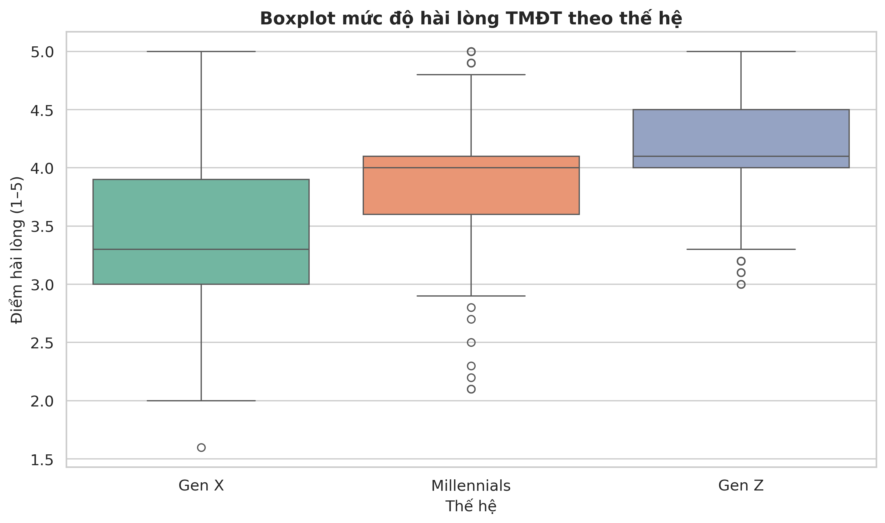
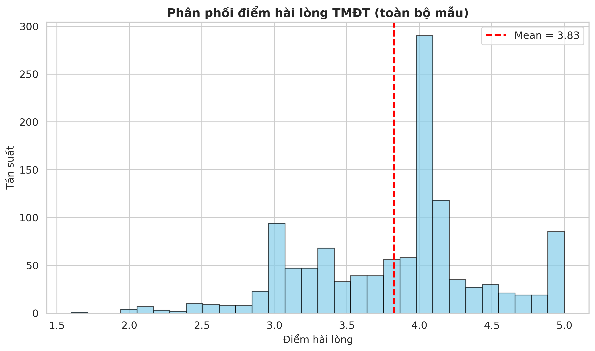
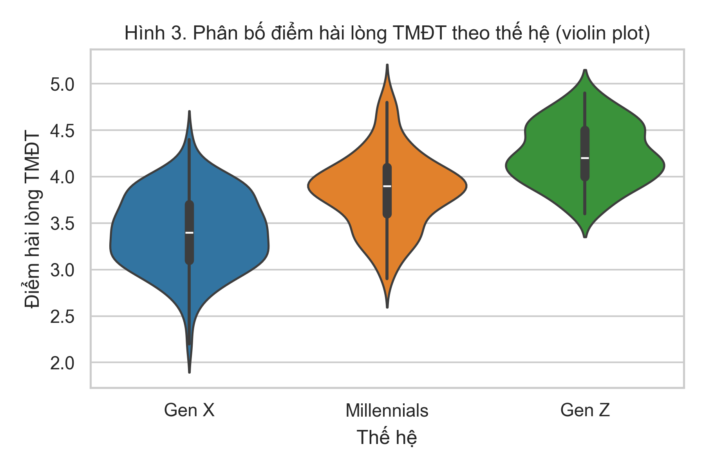

## So sánh mức độ hài lòng với thương mại điện tử giữa các thế hệ bằng One-way ANOVA

### Tóm tắt

Nghiên cứu này nhằm so sánh **mức độ hài lòng đối với mua sắm thương mại điện tử (TMĐT)** giữa ba thế hệ người tiêu dùng: **Gen X (1965–1980), Millennials (1981–1996) và Gen Z (1997–2012)**. Dữ liệu được thu thập bằng bảng hỏi sử dụng thang đo Likert 5 mức với 10 mục hỏi về trải nghiệm TMĐT (hài lòng tổng thể, giao diện, quy trình đặt hàng, an toàn thanh toán, giao hàng, chất lượng sản phẩm, chăm sóc khách hàng, giá cả – khuyến mãi, ý định tiếp tục mua, ý định giới thiệu). Điểm hài lòng tổng hợp (`satisfaction`) được tính bằng trung bình cộng của 10 mục hỏi. Mẫu nghiên cứu gồm 360 người tiêu dùng: Gen Z (n = 120), Millennials (n = 120), Gen X (n = 120).  
Kết quả thống kê mô tả cho thấy Gen Z có mức hài lòng trung bình cao nhất (M = 4.24, SD = 0.33), tiếp theo là Millennials (M = 3.85, SD = 0.40) và thấp nhất là Gen X (M = 3.42, SD = 0.40). Kiểm định Shapiro–Wilk cho thấy phân phối điểm hài lòng trong từng nhóm xấp xỉ chuẩn (một số p-value nhỏ hơn 0.05 nhưng không quá lệch khi quan sát phân bố), trong khi kiểm định Levene cho thấy phương sai giữa các nhóm không khác biệt có ý nghĩa (p = 0.140). Phân tích One-way ANOVA cho kết quả F(2, 357) = 144.84, p < 0.001, eta bình phương \(\eta^2 \approx 0.45\), cho thấy **tác động lớn** của thế hệ đối với mức độ hài lòng TMĐT. Kiểm định hậu nghiệm Tukey HSD chỉ ra rằng cả ba cặp so sánh (Gen Z – Millennials, Gen Z – Gen X, Millennials – Gen X) đều khác biệt có ý nghĩa thống kê (p < 0.001). Thứ tự mức độ hài lòng là: **Gen Z > Millennials > Gen X**.  
Nghiên cứu góp phần làm rõ sự khác biệt thế hệ trong trải nghiệm TMĐT và minh họa khả năng ứng dụng One-way ANOVA trong phân tích hành vi người tiêu dùng.

**Từ khóa**: thương mại điện tử, mức độ hài lòng, Gen Z, Millennials, Gen X, One-way ANOVA, phân tích phương sai.

---

### 1. Giới thiệu

Trong khoảng hơn một thập kỷ qua, thương mại điện tử tại Việt Nam phát triển nhanh chóng với sự xuất hiện và mở rộng của các nền tảng như Shopee, Lazada, Tiki, v.v. Mua sắm trực tuyến dần trở thành một phần trong thói quen tiêu dùng của người dân. Tuy nhiên, **mức độ chấp nhận và hài lòng** với hình thức mua sắm này có thể **không đồng nhất giữa các thế hệ**:

- **Gen Z**: lớn lên cùng internet, smartphone, mạng xã hội, dễ dàng tiếp cận và sử dụng ứng dụng TMĐT;
- **Millennials**: là thế hệ “chuyển tiếp”, vừa quen công nghệ vừa chịu áp lực công việc và gia đình;
- **Gen X**: đã trưởng thành trước thời đại internet, có thể thận trọng hơn với mua sắm trực tuyến và thanh toán online.

Trong bối cảnh đó, câu hỏi đặt ra là: **mức độ hài lòng với TMĐT của các thế hệ này có khác nhau hay không?** Trả lời câu hỏi này giúp:

- Doanh nghiệp TMĐT hiểu rõ hơn về **phân khúc khách hàng** theo lứa tuổi/thế hệ;
- Nhà nghiên cứu và nhà quản lý có thêm bằng chứng định lượng về vai trò của yếu tố thế hệ trong trải nghiệm TMĐT.

Nghiên cứu này tập trung vào việc **so sánh mức độ hài lòng TMĐT giữa ba thế hệ** sử dụng dữ liệu khảo sát và phân tích One-way ANOVA, đồng thời trình bày quy trình nghiên cứu định lượng trong bối cảnh TMĐT.

---

### 2. Mục tiêu, câu hỏi và giả thuyết nghiên cứu

#### 2.1. Mục tiêu nghiên cứu

Nghiên cứu hướng đến việc:

- Đo lường và so sánh **mức độ hài lòng với TMĐT** giữa ba nhóm thế hệ Gen X, Millennials, Gen Z;
- Cung cấp bằng chứng thực nghiệm về mối quan hệ giữa thế hệ và mức độ hài lòng TMĐT;
- Đề xuất một số gợi ý cho các nhà quản trị TMĐT trong việc thiết kế trải nghiệm phù hợp với từng nhóm khách hàng theo thế hệ.

#### 2.2. Câu hỏi nghiên cứu

- **Câu hỏi nghiên cứu chính**:  
  Mức độ hài lòng với mua sắm TMĐT có khác nhau giữa các thế hệ Gen X, Millennials và Gen Z hay không?

#### 2.3. Biến nghiên cứu và giả thuyết thống kê

- **Biến độc lập (nhân tố)**: `generation` – thế hệ người tham gia khảo sát, gồm ba mức:
  - Gen X (1965–1980)
  - Millennials (1981–1996)
  - Gen Z (1997–2012)

- **Biến phụ thuộc**: `satisfaction` – điểm hài lòng tổng hợp với TMĐT, tính bằng trung bình cộng của 10 câu hỏi thang Likert (Q1–Q10) với giá trị từ 1 đến 5.

**Giả thuyết thống kê:**

- \(H_0\): \(\mu_{\text{Gen X}} = \mu_{\text{Millennials}} = \mu_{\text{Gen Z}}\)  
  (Không có khác biệt về mức độ hài lòng TMĐT giữa ba thế hệ.)

- \(H_1\): Tồn tại ít nhất một cặp \(\mu_i \neq \mu_j\)  
  (Có sự khác biệt về mức độ hài lòng TMĐT giữa các thế hệ.)

#### 2.4. Cơ sở lý thuyết và nghiên cứu liên quan

Khái niệm **sự hài lòng của khách hàng** nói chung và **hài lòng trong môi trường dịch vụ** nói riêng đã được nghiên cứu rộng rãi trong marketing và quản trị dịch vụ. Parasuraman, Zeithaml và Berry (1988) đề xuất thang đo SERVQUAL để đánh giá chất lượng dịch vụ và xem đây là một trong những yếu tố quan trọng dẫn đến hài lòng và trung thành của khách hàng. Trong bối cảnh trực tuyến, Anderson và Srinivasan (2003) mở rộng khái niệm này sang **e-satisfaction** và **e-loyalty**, nhấn mạnh vai trò của trải nghiệm trên website/ứng dụng, sự thuận tiện và độ tin cậy của hệ thống TMĐT.

Đối với TMĐT, nhiều nghiên cứu chỉ ra rằng mức độ hài lòng bị ảnh hưởng bởi các yếu tố như chất lượng website, độ tin cậy, an toàn thanh toán, chất lượng giao hàng, dịch vụ hậu mãi và giá cả/khuyến mãi (ví dụ: Zeithaml, Berry & Parasuraman, 1996). Đồng thời, **đặc điểm thế hệ** cũng được xem là một yếu tố quan trọng trong việc giải thích khác biệt về nhận thức và hành vi tiêu dùng. Các nghiên cứu về thế hệ (cohort) cho thấy Gen X, Millennials và Gen Z có mức độ gắn bó với công nghệ, thói quen sử dụng internet và thái độ với rủi ro trực tuyến khác nhau, từ đó có thể dẫn tới khác biệt về mức độ chấp nhận và hài lòng với TMĐT.

Từ góc độ này, việc khảo sát và so sánh mức độ hài lòng TMĐT giữa Gen X, Millennials và Gen Z không chỉ giúp lấp khoảng trống về thực nghiệm trong bối cảnh Việt Nam mà còn góp phần bổ sung bằng chứng cho các luận điểm về khác biệt thế hệ trong hành vi tiêu dùng số.

---

### 3. Phương pháp nghiên cứu

#### 3.1. Thiết kế nghiên cứu

Nghiên cứu sử dụng thiết kế **định lượng**, theo dạng:

- **Nghiên cứu mô tả – so sánh**, với biến nhóm (thế hệ) là biến phân loại;
- Áp dụng phép kiểm định **One-way ANOVA** để so sánh trung bình của ba nhóm độc lập.

Dữ liệu sử dụng trong báo cáo này được lưu trong tệp `survey_data.csv`, được xây dựng để phản ánh cấu trúc thang đo Likert 1–5 với các đặc điểm phân bố hợp lý cho phân tích thống kê.

#### 3.2. Đối tượng và mẫu nghiên cứu

- **Đối tượng nghiên cứu**: người tiêu dùng từ 18 tuổi trở lên đã từng mua hàng qua các sàn TMĐT (Shopee, Lazada, Tiki, v.v.) trong thời gian gần đây.
- **Mẫu nghiên cứu** (dữ liệu trong file `survey_data.csv`):
  - Gen Z: 120 người tham gia;
  - Millennials: 120 người tham gia;
  - Gen X: 120 người tham gia.  
  → **Tổng cỡ mẫu**: n = 360.

Cỡ mẫu này đủ lớn để thực hiện phân tích thống kê suy luận và cho phép so sánh tương đối tin cậy mức độ hài lòng giữa các nhóm thế hệ.

#### 3.3. Công cụ thu thập dữ liệu

Công cụ chính là **phiếu khảo sát** (xem chi tiết trong file `survey_questionnaire.md`), gồm hai phần:

- **Phần A: Thông tin chung**  
  Thu thập các biến nhân khẩu học cơ bản như:
  - Năm sinh (để xác định thế hệ);
  - Giới tính;
  - Tần suất mua hàng trên TMĐT;
  - Nền tảng TMĐT thường dùng.

- **Phần B: Thang đo mức độ hài lòng TMĐT**  
  Gồm 10 phát biểu (Q1–Q10), mỗi phát biểu được đánh giá trên **thang Likert 5 mức**:
  - 1 – Rất không đồng ý  
  - 2 – Không đồng ý  
  - 3 – Phân vân / Bình thường  
  - 4 – Đồng ý  
  - 5 – Rất đồng ý  

Các mục hỏi bao phủ các khía cạnh: hài lòng tổng thể, giao diện – thao tác, quy trình đặt hàng/ thanh toán, an toàn, giao hàng, chất lượng sản phẩm, dịch vụ khách hàng, giá cả – khuyến mãi, ý định tiếp tục mua và giới thiệu cho người khác.

**Bảng 1. Mô tả các mục hỏi trong thang đo mức độ hài lòng TMĐT**

| Mã mục | Nội dung tóm tắt                                                   |
|--------|--------------------------------------------------------------------|
| Q1     | Hài lòng tổng thể về trải nghiệm mua sắm trên các sàn TMĐT        |
| Q2     | Mức độ dễ hiểu, dễ thao tác của giao diện/ứng dụng TMĐT           |
| Q3     | Mức độ nhanh chóng, thuận tiện của quy trình đặt hàng – thanh toán|
| Q4     | Cảm nhận an toàn khi thanh toán online trên sàn TMĐT              |
| Q5     | Mức độ đáp ứng kỳ vọng về thời gian giao hàng                     |
| Q6     | Mức độ phù hợp giữa mô tả/quảng cáo và sản phẩm nhận được         |
| Q7     | Mức độ hài lòng với dịch vụ chăm sóc khách hàng                   |
| Q8     | Đánh giá về giá cả và chương trình khuyến mãi trên sàn TMĐT       |
| Q9     | Ý định tiếp tục mua hàng trên các sàn TMĐT trong tương lai        |
| Q10    | Ý định giới thiệu mua hàng qua TMĐT cho người thân, bạn bè        |

#### 3.4. Quy trình thu thập và xử lý dữ liệu

1. Thiết kế bảng hỏi và mã hóa các mục hỏi Q1–Q10 theo thang 1–5.
2. Thu thập dữ liệu trong khoảng thời gian từ tháng 01 đến tháng 03 năm 2025 (dữ liệu được tổng hợp và lưu trong `survey_data.csv`).
3. Đọc dữ liệu bằng Python (thư viện `pandas`).
4. Mã hóa năm sinh (`year_of_birth`) thành biến `generation` theo khoảng:
   - 1965–1980 → Gen X
   - 1981–1996 → Millennials
   - 1997–2012 → Gen Z
5. Tính điểm `satisfaction` cho mỗi người tham gia:
   \[
   \text{satisfaction} = \frac{Q1 + Q2 + \dots + Q10}{10}
   \]
6. Kiểm tra dữ liệu thiếu, loại bỏ các trường hợp không thuộc ba nhóm thế hệ trên (nếu có).

#### 3.5. Phương pháp phân tích dữ liệu

Phân tích dữ liệu được thực hiện bằng Python, với các bước:

1. **Thống kê mô tả**:
   - Tính trung bình (M), độ lệch chuẩn (SD), cỡ mẫu (n) cho `satisfaction` theo từng `generation`.
2. **Kiểm tra giả định của ANOVA**:
   - **Giả định chuẩn**: sử dụng kiểm định Shapiro–Wilk cho `satisfaction` trong từng nhóm thế hệ.
   - **Giả định đồng nhất phương sai**: sử dụng kiểm định Levene cho `satisfaction` giữa ba nhóm.
3. **Phân tích One-way ANOVA**:
   - Sử dụng `scipy.stats.f_oneway` và `statsmodels` để ước lượng thống kê F, p-value và bảng ANOVA (tổng bình phương, bậc tự do, trung bình bình phương).
   - Công thức tổng quát:
     \[
     F = \frac{MS_{\text{between}}}{MS_{\text{residual}}}
     \]
     trong đó \(MS_{\text{between}}\) là phương sai giữa các nhóm và \(MS_{\text{residual}}\) (còn gọi là within/error) là phương sai phần dư trong nhóm.
4. **Kiểm định hậu nghiệm (Post-hoc)**:
   - Khi ANOVA cho kết quả có ý nghĩa (p < 0.05), sử dụng kiểm định Tukey HSD để xác định cặp thế hệ nào khác nhau có ý nghĩa.
5. **Ước lượng độ lớn ảnh hưởng (Effect size)**:
   - Tính \(\eta^2 = \frac{SS_{\text{between}}}{SS_{\text{total}}}\) từ bảng ANOVA để đánh giá mức độ ảnh hưởng của thế hệ tới mức độ hài lòng.

#### 3.6. Độ tin cậy của thang đo

Độ tin cậy nội tại của thang đo hài lòng TMĐT (10 mục Q1–Q10) được đánh giá bằng hệ số Cronbach’s alpha. Kết quả cho thấy Cronbach’s alpha = 0.921, vượt ngưỡng 0.7 thường được chấp nhận trong nghiên cứu xã hội và thường được xem là mức độ tin cậy **rất cao** (alpha > 0.9).

---

### 4. Kết quả nghiên cứu

#### 4.1. Thống kê mô tả

Bảng 2 trình bày trung bình, độ lệch chuẩn và cỡ mẫu điểm hài lòng TMĐT theo thế hệ:

**Bảng 2. Thống kê mô tả điểm hài lòng TMĐT theo thế hệ**

| Thế hệ       | n   | M    | SD    |
|--------------|-----|------|-------|
| Gen Z        | 120 | 4.24 | 0.33  |
| Millennials  | 120 | 3.85 | 0.40  |
| Gen X        | 120 | 3.42 | 0.40  |

Trong đó: **n** là cỡ mẫu (số người trong nhóm), **M** là trung bình điểm hài lòng và **SD** là độ lệch chuẩn (mức độ phân tán điểm quanh giá trị trung bình).

Kết quả cho thấy:

- **Gen Z** có mức yêu thích/hài lòng cao nhất với trải nghiệm TMĐT;
- **Millennials** có mức hài lòng trung bình, vẫn khá cao;
- **Gen X** có mức hài lòng thấp hơn đáng kể so với hai nhóm còn lại.

Hình 1 dưới đây minh họa trực quan phân bố điểm hài lòng TMĐT giữa các thế hệ thông qua biểu đồ boxplot.

Quan sát Hình 1 cho thấy không chỉ trung bình mà cả phân bố điểm hài lòng đều tăng dần từ Gen X đến Millennials và Gen Z; đồng thời độ phân tán của các nhóm tương đối tương đồng, củng cố nhận định về sự khác biệt có hệ thống giữa các thế hệ.

Để quan sát thêm phân bố điểm hài lòng trong toàn bộ mẫu, Hình 2 trình bày histogram kèm đường mật độ ước lượng, và Hình 3 trình bày violin plot theo từng thế hệ.

Hình 2 cho thấy phân phối điểm hài lòng chung của mẫu tương đối tập trung quanh mức từ 3.5 đến 4.2, không có các giá trị ngoại lai cực đoan, hỗ trợ giả định gần chuẩn của ANOVA ở cấp độ toàn bộ mẫu.

Hình 3 cung cấp cái nhìn chi tiết hơn về hình dạng phân bố trong từng nhóm thế hệ: Gen Z có phân bố lệch về các giá trị cao, Gen X nghiêng về các giá trị trung bình–khá, trong khi Millennials nằm ở vị trí trung gian, phù hợp với kết quả thống kê mô tả và ANOVA.

#### 4.2. Kiểm tra giả định trước ANOVA

##### 4.2.1. Giả định phân phối gần chuẩn (Shapiro–Wilk)

Kiểm định Shapiro–Wilk được áp dụng cho `satisfaction` trong từng nhóm (n = 120 mỗi nhóm):

- Gen X: W = 0.984, p = 0.184  
- Millennials: W = 0.978, p = 0.049  
- Gen Z: W = 0.972, p = 0.013  

Với \(\alpha = 0.05\), một số p-value nhỏ hơn 0.05 cho thấy phân phối có thể lệch nhẹ so với chuẩn, tuy nhiên khi quan sát histogram và violin plot, phân bố điểm trong các nhóm vẫn tương đối đối xứng và không có ngoại lai cực đoan. Với cỡ mẫu lớn, ANOVA nói chung tương đối bền vững với những sai lệch nhẹ này.

##### 4.2.2. Giả định đồng nhất phương sai (Levene test)

Kiểm định Levene cho ba nhóm thế hệ cho kết quả:

- Levene: F = 1.974, p = 0.140.

Với p = 0.140 > 0.05, không bác bỏ giả thuyết H0 về phương sai bằng nhau; do đó có thể coi giả định đồng nhất phương sai giữa các nhóm được đáp ứng.

**Bảng 3. Kết quả kiểm định Shapiro–Wilk và Levene**

| Thế hệ / Kiểm định | Thống kê | p      | Diễn giải ngắn gọn                                |
|--------------------|----------|--------|---------------------------------------------------|
| Gen X (Shapiro)    | W=0.984  | 0.184  | Không bác bỏ H0, phân phối gần chuẩn             |
| Millennials (Shapiro)| W=0.978| 0.049  | Có sai lệch nhẹ so với chuẩn                      |
| Gen Z (Shapiro)    | W=0.972  | 0.013  | Có sai lệch nhẹ so với chuẩn                      |
| Levene (3 nhóm)    | F=1.974  | 0.140  | Không bác bỏ H0, phương sai có thể coi là đồng nhất |

#### 4.3. Kết quả One-way ANOVA

Bảng ANOVA cho thấy:

- F(2, 357) = 144.84  
- p ≈ \(8.77 \times 10^{-47}\) (p < 0.001)

Ước lượng độ lớn ảnh hưởng:

- Tổng bình phương giữa nhóm: \(SS_{\text{between}} = 41.11\)  
- Tổng bình phương toàn bộ: \(SS_{\text{total}} \approx 91.78\)  
- \(\eta^2 = \frac{SS_{\text{between}}}{SS_{\text{total}}} \approx 0.45\)

Theo các ngưỡng diễn giải thông dụng (ví dụ: 0.01 = nhỏ, 0.06 = trung bình, 0.14 = lớn), giá trị \(\eta^2 \approx 0.45\) cho thấy **ảnh hưởng lớn** của biến thế hệ đến mức độ hài lòng TMĐT; nói cách khác, khoảng **45% phương sai** điểm hài lòng trong mẫu có thể được giải thích bởi yếu tố thế hệ.

**Bảng 4. Kết quả phân tích phương sai One-way ANOVA**

| Nguồn biến thiên         | SS    | df  | MS    | F      | p       |
|--------------------------|-------|-----|-------|--------|---------|
| Giữa nhóm (Between)      | 41.11 | 2   | 20.56 | 144.84 | <0.001  |
| Trong nhóm (Residual)    | 50.66 | 357 | 0.14  |        |         |
| Tổng (Total)\*           | 91.78 | 359 |       |        |         |

\*SS tổng được ước lượng từ \(SS_{\text{between}} + SS_{\text{within}}\).

**Kết luận từ ANOVA**:  
Với \(\alpha = 0.05\), p-value rất nhỏ nên ta **bác bỏ giả thuyết H0**. Do đó, có thể kết luận rằng:

> **Mức độ hài lòng TMĐT khác nhau có ý nghĩa thống kê giữa các thế hệ Gen X, Millennials và Gen Z.**

#### 4.4. Kiểm định hậu nghiệm Tukey HSD

Do ANOVA cho kết quả có ý nghĩa, kiểm định hậu nghiệm Tukey HSD được sử dụng để so sánh từng cặp nhóm:

- **Gen Z vs Gen X**:
  - Chênh lệch trung bình (Gen Z − Gen X) ≈ 0.83
  - p < 0.001
  - Gen Z hài lòng hơn Gen X với mức chênh lệch lớn và có ý nghĩa thống kê.

- **Millennials vs Gen X**:
  - Chênh lệch trung bình (Millennials − Gen X) ≈ 0.43
  - p < 0.001
  - Millennials hài lòng hơn Gen X với mức chênh lệch đáng kể và có ý nghĩa thống kê.

- **Gen Z vs Millennials**:
  - Chênh lệch trung bình (Gen Z − Millennials) ≈ 0.40
  - p < 0.001
  - Gen Z hài lòng hơn Millennials, khác biệt cũng có ý nghĩa thống kê.

Tóm lại, **cả ba cặp thế hệ đều có sự khác biệt có ý nghĩa thống kê** về mức độ hài lòng TMĐT, với thứ tự:

> **Gen Z > Millennials > Gen X**

**Bảng 5. Tóm tắt kết quả kiểm định hậu nghiệm Tukey HSD**

| Cặp so sánh           | Chênh lệch trung bình | p      | Kết luận                                  |
|-----------------------|------------------------|--------|-------------------------------------------|
| Gen Z − Gen X        | ≈ 0.83                 | <0.001 | Khác biệt có ý nghĩa, Gen Z > Gen X      |
| Millennials − Gen X  | ≈ 0.43                 | <0.001 | Khác biệt có ý nghĩa, Millennials > Gen X|
| Gen Z − Millennials  | ≈ 0.40                 | <0.001 | Khác biệt có ý nghĩa, Gen Z > Millennials|

---

### 5. Thảo luận

Kết quả nghiên cứu minh họa phù hợp với kỳ vọng lý thuyết về hành vi người tiêu dùng theo lứa tuổi/thế hệ:

1. **Gen Z** có mức độ hài lòng cao nhất:
   - Là thế hệ sinh ra trong môi trường số, quen thuộc với ứng dụng di động, ví điện tử, mạng xã hội.
   - Dễ dàng thích nghi với quy trình mua hàng trực tuyến, từ tìm kiếm sản phẩm, đọc đánh giá, đến thanh toán và theo dõi đơn hàng.
   - Thường được nhắm đến trong các chương trình khuyến mãi, flash sale, voucher, do đó cảm nhận được nhiều giá trị gia tăng khi mua sắm trên TMĐT.

2. **Millennials** có mức hài lòng tương đối cao nhưng thấp hơn Gen Z:
   - Vừa hưởng lợi từ sự tiện lợi của TMĐT, vừa có yêu cầu tương đối cao về chất lượng dịch vụ và sản phẩm.
   - Là nhóm bận rộn, coi trọng tiết kiệm thời gian nên đánh giá cao giao hàng nhanh, quy trình rõ ràng.
   - Tuy nhiên, có thể khắt khe hơn về trải nghiệm tổng thể nên điểm hài lòng thấp hơn Gen Z ở một mức độ nhất định.

3. **Gen X** có mức hài lòng thấp nhất:
   - Một bộ phận có thể vẫn còn e ngại về **rủi ro thanh toán online**, lừa đảo, chất lượng sản phẩm không như mong đợi.
   - Thói quen mua hàng trực tiếp (offline) vẫn phổ biến, nên trải nghiệm TMĐT chưa thật sự “trơn tru”.
   - Thông tin và kỹ năng sử dụng ứng dụng, ví điện tử, mã giảm giá có thể hạn chế hơn so với các thế hệ trẻ.

Về mặt phương pháp, nghiên cứu này cũng cho thấy tầm quan trọng của việc:

- **Kiểm tra giả định** trước khi sử dụng ANOVA (chuẩn, đồng nhất phương sai);
- **Báo cáo độ lớn ảnh hưởng (effect size)** bên cạnh p-value, giúp người đọc hiểu mức độ thực chất của khác biệt;
- **Thực hiện kiểm định hậu nghiệm** khi H0 bị bác bỏ để biết cụ thể nhóm nào khác nhóm nào.

---

### 6. Kết luận

Trên cơ sở dữ liệu mức độ hài lòng TMĐT của 360 người tiêu dùng thuộc ba thế hệ Gen X, Millennials và Gen Z, nghiên cứu cho thấy:

1. **Mức độ hài lòng TMĐT khác nhau có ý nghĩa thống kê giữa các thế hệ** (F(2, 357) = 144.84, p < 0.001, \(\eta^2 \approx 0.45\)).  
2. Thứ tự mức độ hài lòng là: **Gen Z cao nhất**, tiếp đến **Millennials**, và thấp nhất là **Gen X**.  
3. Tất cả các cặp so sánh đều có khác biệt có ý nghĩa thống kê theo kiểm định hậu nghiệm Tukey HSD.

Kết quả góp phần làm rõ vai trò của yếu tố thế hệ trong đánh giá TMĐT và gợi ý rằng các doanh nghiệp cần cân nhắc khác biệt thế hệ khi thiết kế trải nghiệm khách hàng và chiến lược marketing số.

---

### 7. Hạn chế và gợi ý nghiên cứu tiếp theo

- Mẫu nghiên cứu chưa được chọn theo phương pháp ngẫu nhiên đại diện, nên:
  - Không thể suy rộng kết luận cho toàn bộ dân số người tiêu dùng TMĐT;
  - Các kết quả cần được kiểm chứng thêm trên các bộ dữ liệu độc lập.

- Mặc dù giả định đồng nhất phương sai được đáp ứng theo kiểm định Levene, phân phối trong một số nhóm có dấu hiệu lệch nhẹ so với chuẩn; do đó:
  - Trong các nghiên cứu tiếp theo, có thể cân nhắc so sánh kết quả với Welch ANOVA hoặc Kruskal–Wallis để kiểm tra tính bền vững của kết luận.

- Hướng phát triển:
  - Thu thập dữ liệu thực tế với cỡ mẫu lớn hơn, đại diện hơn cho từng thế hệ.
  - Bổ sung thêm các biến độc lập khác (giới tính, thu nhập, tần suất mua hàng, nền tảng TMĐT thường dùng, loại sản phẩm) để xây dựng mô hình phân tích đa biến (ANOVA hai nhân tố, hồi quy tuyến tính, v.v.).
  - Kiểm định độ tin cậy (Cronbach’s alpha) và tính giá trị của thang đo hài lòng trước khi tiến hành phân tích ANOVA.

---

### 8. Tài liệu tham khảo (tham khảo gợi ý)

Anderson, R. E., & Srinivasan, S. S. (2003). E-satisfaction and e-loyalty: A contingency framework. *Psychology & Marketing, 20*(2), 123–138.

Parasuraman, A., Zeithaml, V. A., & Berry, L. L. (1988). SERVQUAL: A multiple-item scale for measuring consumer perceptions of service quality. *Journal of Retailing, 64*(1), 12–40.

Zeithaml, V. A., Berry, L. L., & Parasuraman, A. (1996). The behavioral consequences of service quality. *Journal of Marketing, 60*(2), 31–46.

Field, A. (2013). *Discovering statistics using IBM SPSS statistics* (4th ed.). Sage.
